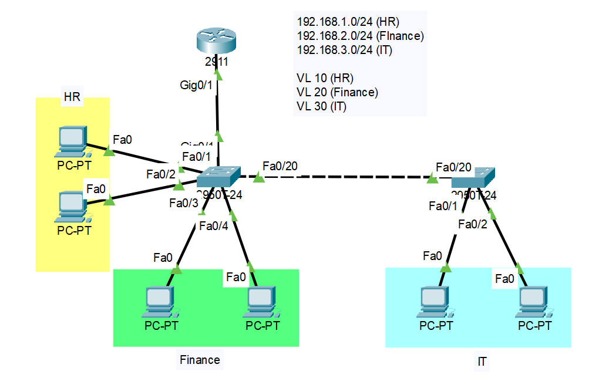

# CCNA Project: VLAN & Inter-VLAN Routing (Router-on-a-Stick)

### 📝 **Project Description**
This project simulates network segmentation using VLANs and implements inter-VLAN routing via **router-on-a-stick** on Cisco routers and switches in Packet Tracer. It ensures that devices in different VLANs can communicate through router subinterfaces.

---

### 🖥️ **Topology**



---

### 🔧 **Device Summary**
| Device Type | Quantity | Role |
|-------------|----------|------|
| Router | 1 | Router-on-a-stick for inter-VLAN routing |
| Switch | 2 | VLAN assignment & trunking |
| PC | 6 | End devices for HR, Finance, and IT |

---

### 🌐 **IP Addressing & VLAN Plan**

| VLAN | Name | Network | Gateway (Router Subinterface) |
|------|------|---------|-------------------------------|
| 10 | HR | 192.168.1.0/24 | 192.168.1.254 |
| 20 | Finance | 192.168.2.0/24 | 192.168.2.254 |
| 30 | IT | 192.168.3.0/24 | 192.168.3.254 |

---

### ⚙️ **Technologies Used**
- VLAN creation & assignment  
- 802.1Q trunking between switches and router  
- Router-on-a-stick inter-VLAN routing (subinterfaces)  
- Static IP assignment on end devices
- Dinamic IP assignmetn on end device
- DHCP server internal

---

### 🚀 **Configuration Steps**

#### **1. Router Configuration (R1)**

```
enable
conf t

hostname R-1

interface Gig0/1
 no sh

interface Gig0/1.10
 encapsulation dot1q 10
 ip address 192.168.1.254 255.255.255.0

interface Gig0/1.20
 encapsulation dot1q 20
 ip address 192.168.2.254 255.255.255.0

interface Gig0/1.30
 encapsulation dot1q 30
 ip address 192.168.3.254 255.255.255.0

ip dhcp pool HR
 network 192.168.1.0 255.255.255.0
 default-router 192.168.1.254
 dns-server 8.8.8.8

ip dhcp pool Finance
 network 192.168.2.0 255.255.255.0
 default-router 192.168.2.254
 dns-server 8.8.8.8

ip dhcp pool IT
 network 192.168.3.0 255.255.255.0
 default-router 192.168.3.254
 dns-server 8.8.8.8

ip dhcp exclude-address 192.168.1.254
ip dhcp exclude-address 192.168.2.254
ip dhcp exclude-address 192.168.3.254

exit
```
#### **2. Switch Configuration (SW1)**

```
enable
conf t

hostname SW-1

vlan 10
 name HR
vlan 20
 name Finance
vlan 30
 name IT

interface FastEthernet0/1
 Switchport access vlan 10
 Switchport mode access

interface FastEthernet0/2
 Switchport access vlan 10
 Switchport mode access

interface FastEthernet0/3
 Switchport access vlan 20
 Switchport mode access

interface FastEthernet0/1
 Switchport access vlan 20
 Switchport mode access

interface GigabitEthernet0/1
 Switchport mode trunk

interface range fa0/5-19, fa0/21-24, Gig0/2
 sh

exit
```
#### **3. Switch Configuration (SW2)**

```
enable
conf t

hostname SW-2

vlan 10
 name HR
vlan 20
 name Finance
vlan 30
 name IT

interface FastEthernet0/1
 Switchport access vlan 10
 Switchport mode access

interface FastEthernet0/2
 Switchport access vlan 10
 Switchport mode access

interface FastEthernet0/20
 Switchport mode trunk

interface range fa0/3-19, fa0/21-24, Gig0/1-2
 sh
```

### ✅  **Testing Results**


